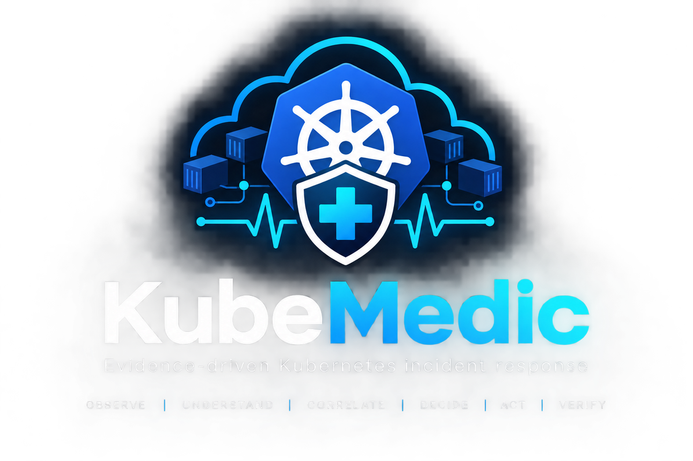

<p align="center">
  
</p>

<h1 align="center">KubeMedic</h1>
<p align="center"><b>Evidence-driven Kubernetes incident response, with a human in the loop.</b></p>

<p align="center">
  <a href="https://github.com/Edith-Stark06/Kubemedic/actions/workflows/ci.yml"></a>
  
  
  
  <a href="LICENSE"></a>
</p>

KubeMedic watches a Kubernetes workload. When a deployment goes bad it collects
evidence through an MCP server, uses IBM Bob to correlate several symptoms into
one incident and reason about the cause, proposes an impact-aware remediation,
**pauses for a human decision**, executes only an allowlisted action after
approval, and independently verifies that the service actually recovered.

It is not an autonomous healing platform, and it is careful not to pretend to
be one.

```
tickets ─┐
tickets ─┼──► MCP evidence ──► IBM Bob ──► root cause ──► remediation plan
tickets ─┘                                                      │
                                                        human final review
                                                        ╱             ╲
                                                  approve            reject
                                                     │            (reason required)
                                                 execute                │
                                                     │          feedback → Bob
                                              independent               │
                                              verification          revised plan
                                                     │                  │
                                                 resolved  ◄────  review again
                                                     │
                                              audit record
```

## Contents

- [The four rules](#the-four-rules)
- [Layout](#layout)
- [Setup](#setup)
- [Choosing the reasoning engine](#choosing-the-reasoning-engine)
- [Document understanding: an operational runbook](#document-understanding-an-operational-runbook)
- [Configuration](#configuration)
- [Running it](#running-it)
- [Security model](#security-model)
- [Deploying KubeMedic itself](#deploying-kubemedic-itself)
- [The API](#the-api)
- [The MCP evidence surface](#the-mcp-evidence-surface)
- [Known limitations](#known-limitations)
- [Documentation](#documentation)
- [License](#license)

## The four rules

From `AGENTS.md`, and they are enforced in code, not just stated:

1. **Never fabricate evidence.** If a tool call failed, say so.
2. **Separate fact from inference from recommendation.** Label them.
3. **Never claim success without evidence.** Recovery is the rollout reporting
   healthy *and* the application answering 200, re-read after the fact.
4. **Never execute anything a model composed.** Every mutation is a named,
   allowlisted operation with a validated target, performed through the
   Kubernetes API after a recorded human approval.

Where the code enforces each:

| Rule | Enforced by | Test |
|---|---|---|
| No fabricated analysis | `agent/reasoning.py` — every engine failure yields `analysis_source: "unavailable"` | `test_reasoning_on_bob_unavailable_does_not_fabricate` |
| No unapproved mutation | `Incident.require_approval()` in `agent/executor.py` | `test_execute_without_approval_raises` |
| A rejected plan can never execute | `_ILLEGAL_TRANSITIONS` in `agent/models.py` | `test_rejected_to_executing_is_unreachable` |
| Rejection requires a reason | `HumanDecision` validator; `400 feedback_required` in `agent/api.py` | `test_rejection_without_feedback_is_400_feedback_required` |
| No shell, ever | `AllowedAction` enum + `_dispatch` in `agent/executor.py` | `test_action_enum_rejects_kubectl_string` |
| Verification is independent | `agent/verification.py` re-reads the cluster on two signals | `test_tool_error_inconclusive` |

## Layout

```
agent/          reasoning, correlation, planning, execution, verification, audit, API, CLI
  api.py            HTTP surface over the lifecycle; serves the console at /ui
  cli.py            the whole lifecycle from a terminal
  bob.py            the IBM Bob REST client
  models.py         every contract; the allowlist and the illegal transitions
  k8s_client.py     the only module that changes a cluster
  providers/        pluggable reasoning engines, one failure policy
  secrets.py        every credential resolves through here
  demo_tooling.py   presenter fault injection — deliberately outside the agent's action surface
mcp_server/     the evidence surface the model is allowed to see
  evidence.py       read-only Kubernetes inspection
  server.py         MCP stdio server; --profile evidence is read-only
k8s/            the ticket-booking demo workload
workload/       the demo app; HEALTHY=false is the incident lever
static/         the operator console: plain HTML/CSS/JS, no build step
dashboard/      the separate FastAPI incident console (port 8080)
scripts/        inject, reset, the deterministic dry run, the live validation harness
tests/          470 tests
docs/           architecture, contracts, gaps, compliance
submission/     contest deliverables and executed evidence
```

## Setup

Requires Python 3.12+ (CI checks 3.12 and 3.13) and, for the live loop, a
Kubernetes cluster (developed on k3s via Rancher Desktop).

```bash
git clone https://github.com/Edith-Stark06/Kubemedic.git
cd Kubemedic
python -m venv .venv && source .venv/Scripts/activate   # Linux/macOS: .venv/bin/activate
pip install -r requirements.txt -r requirements-dev.txt
python -m pytest
```

Expected: `470 passed`. The suite needs no cluster and no credentials — the
Kubernetes API is mocked and every ticket test uses a temporary database.

CI (`.github/workflows/ci.yml`) additionally byte-compiles every module,
imports all three applications, and asserts the evidence profile is read-only
rather than trusting the claim.

## Choosing the reasoning engine

The engine is a configuration choice. Everything downstream is unchanged,
because every provider returns the same validated analysis contract.

| Provider | What it is | Credentials |
|---|---|---|
| `ibm-bob` | IBM Bob 2.0, driven headlessly through Bob Shell (`bob run`) | `KUBEMEDIC_BOB_API_KEY` (Inference scope) |
| `watsonx` | IBM watsonx.ai | `KUBEMEDIC_WATSONX_API_KEY` + `_PROJECT_ID` |
| `anthropic` | Claude (development / fallback) | `KUBEMEDIC_ANTHROPIC_API_KEY` |
| `gemini` | Google Gemini | `KUBEMEDIC_GEMINI_API_KEY` (or `GEMINI_API_KEY`) |
| `manual` | JSON from an interactive IBM Bob session | none — Bob reasons in the workspace, calling the read-only MCP server itself |
| `host` | the agentic IDE hosting this workspace, via a file hand-off in `.kubemedic/` | none |

The default is `auto`: the first configured engine answers. The two IBM
engines are flagged out of that order until `KUBEMEDIC_IBM_ENABLED=true`
(watsonx auth works but its WML instance is inactive). Selecting one by name
always works, and `KUBEMEDIC_REASONING_PROVIDER=ibm-bob` is how you run on Bob.

**How Bob is called.** `agent/providers/ibm_bob.py` runs `bob run` with a fixed
argument list — never a shell — in a dedicated workspace
(`agent/providers/bob_workspace/`) that contains only a tool-less
`kubemedic-reasoner` mode. Every Bob tool group is disabled, the run is capped
by `--max-cost` and `--max-turns`, and a timeout is *not* retried because Bob
usage is metered. The API key reaches the child process through its environment
only. Bob's own gateway refuses clients it does not recognise, so the provider
drives the official CLI instead of calling the gateway directly.

Why the dedicated workspace: run from the repository root, Bob loads the
project's interactive rules ("call the MCP tools first") into a headless run
where no tools exist — and with tools disabled it then **invented the tool
calls and their responses, including tickets that were not in the evidence.**
That was observed, not hypothesised. Two defences now exist: the tool-less mode,
and `agent/reasoning.py`, which treats any analysis citing a ticket it was not
given as unavailable.

Cross-vendor fallback is **off by default** (`AI_FALLBACK_ENABLED=false`): a
fallback sends the incident's evidence to a different vendor than the one you
configured, so it is an operator's decision. A failure is never retried in
place, and the reason the primary could not answer is carried into the audit
record.

`GET /api/provider` reports which engine is active, whether each is configured,
and per-provider call and failure counters. `POST /api/provider/select`
switches engines at runtime — it changes which engine actually answers, it
does not relabel one as another. `GET /health/ai` reports which engine will
answer and why. None of them probe the network or echo a credential.

Without any credentials the system still runs — it collects evidence,
correlates tickets, and reports the analysis unavailable. It produces no plan
and nothing can be approved. That is the designed behaviour: it reports the
outage rather than inventing a diagnosis.

## Document understanding: an operational runbook

`docs/RUNBOOK_TICKET_BOOKING.md` is a real, short playbook: known failure
classes for the demo service, and which of the three allowed actions the team
prefers for each, and why. `agent/runbook.py` loads it (`KUBEMEDIC_RUNBOOK_PATH`,
empty string to disable) and `agent/providers/prompt.py` hands it to the
reasoning engine in its own fenced `<runbook>` section — distinct from cluster
evidence, with instructions to weigh it rather than obey it blindly, and to say
so if the two disagree.

Run against IBM Bob live, Bob's `reason` field named the playbook's failure
class by number and stated its rule directly: *"The playbook explicitly names
this failure class ... and mandates rollback_deployment rather than
restart_deployment, because a restart would recreate pods on the same broken
image."* `submission/evidence/INC-20260926T213503-001.json`.

## Configuration

```bash
cp .env.example .env
```

| Variable | Purpose |
|---|---|
| `KUBEMEDIC_REASONING_PROVIDER` | Which engine answers: the table above, or `auto` (default) |
| `KUBEMEDIC_SECRETS_BACKEND` | Where credentials are read from: `env`, `file`, `k8s`, `vault` |
| `AI_PRIMARY_PROVIDER` / `AI_FALLBACK_PROVIDER` / `AI_FALLBACK_ENABLED` | The fallback chain |
| `KUBEMEDIC_IBM_ENABLED` | `true` puts the IBM engines back in the `auto` order |
| `KUBEMEDIC_NAMESPACE` / `_DEPLOYMENT` / `_SERVICE` | Watched workload. Defaults `opspilot` / `ticket-booking` |
| `KUBEMEDIC_AGENT_BASE_URL` | Points the legacy dashboard at the live agent API |
| `KUBEMEDIC_API_HOST` / `_PORT` | Agent API bind address. Default `127.0.0.1:8100` |

## Running it

### Without a cluster or credentials: the deterministic dry run

```bash
python scripts/dry_run.py --non-interactive
```

Walks the whole lifecycle — inject, tickets, MCP evidence, correlation,
analysis, proposal, human review, rejection with feedback, revised plan,
approval, execution, verification, resolved. The fixture is the *cluster*, not
the logic: correlation, the approval gate, the executor allowlist, the verifier
and the audit trail are the real code paths; only the thing being observed and
mutated is simulated. When no engine is reachable the scripted reasoner is
stamped `analysis_source: "fixture"`, and the run says so — a RESOLVED status
never implies live reasoning.

### Against a live cluster

```bash
# 1. Build both images from the same source
cd workload
docker build --build-arg APP_VERSION=1.0 --build-arg HEALTHY=true  -t ticketbooking:1.0 .
docker build --build-arg APP_VERSION=1.1 --build-arg HEALTHY=false -t ticketbooking:1.1 .
cd ..

# 2. Deploy the healthy baseline
kubectl apply -f k8s/namespace.yaml -f k8s/deployment.yaml -f k8s/service.yaml
kubectl -n opspilot rollout status deployment/ticket-booking

# 3. Prove the whole loop, with assertions
bash scripts/validate.sh
```

`validate.sh` resets to healthy, injects a real failure, lets the watcher file
tickets, correlates them into one incident, asserts that an unapproved
execution is refused and leaves the cluster untouched, rejects a plan without a
reason and confirms that is refused, rejects *with* a reason and confirms
nothing executed, approves, executes a real rollback, verifies recovery on two
independent signals, and writes an audit record. Exit code 0 only if every
check passes. Its output, and three executed incident records, are in
`submission/evidence/`.

### The console and the CLI

```bash
python -m agent.api        # console -> http://127.0.0.1:8100/ui/ · API docs -> /docs
python -m agent.cli run    # the whole loop from a terminal, pausing at the human gate
```

The console runs the demo (fixture cluster) or orchestrates the live one —
break, watch, reset — and switches reasoning engines at runtime. Fault
injection is presenter tooling and lives in `agent/demo_tooling.py`, so the
executor's allowlist stays exactly three actions and nothing the model can
reach can ship a bad image.

The CLI subcommands: `status`, `providers`, `watch`, `tickets`,
`incident new|show|list`, `approve`, `reject -m "reason"`, `revise`, `execute`,
`run`. Exit codes: 0 success, 1 failure, 2 refused by a safety guard — a
refusal is distinguishable from a crash.

### The failure, and why it is a good one

`k8s/deployment.yaml` is built so the demo failure is clean and reversible:

- `maxUnavailable: 0` keeps the old healthy pods serving, so a bad revision
  shows up as a **stalled rollout**, not an outage.
- Readiness probes `/ready`; the bad image bakes `HEALTHY=false`, so `/ready`
  fails and new pods never go Ready.
- Liveness is a plain TCP check, deliberately not wired to `/health` — the app
  honestly returns 500 there when degraded, and that would crash-loop the pod.
  TCP keeps it `Running` but `0/1 Ready`: a clean readiness regression.

A useful consequence: during this incident the application health endpoint
keeps returning **200**, because the old pods are still serving. The health
signal alone would miss the failure; the rollout signal catches it. That is the
argument for verifying on two independent signals rather than trusting one.

## Security model

- **Authentication.** `KUBEMEDIC_REQUIRE_AUTH=true` requires a bearer token on
  every route except liveness. Tokens (`KUBEMEDIC_API_TOKENS`,
  `identity:role:token`) carry a role: `viewer` reads; `approver` opens
  incidents, reviews, revises and executes; `admin` adds presenter tooling. With
  auth required and no tokens configured the API refuses everything and will not
  start.
- **Accountability.** With auth on, the approver in the audit trail is the
  token's identity; the `approver` in a request body is ignored. Execution and
  incident creation are attributed the same way.
- **Presenter tooling** (fault injection, the fixture cluster, the engine
  switch) is on in development and **off when auth is required**, unless enabled
  explicitly.
- **The model's target is checked.** A plan must target the workload the
  incident is about, or it is refused before a human sees it; the executor
  checks again. Incidents can only be opened for `KUBEMEDIC_ALLOWED_NAMESPACES`.
- **Rollback restores the whole pod template**, as `kubectl rollout undo` does,
  not just the image. Scaling below one replica is refused: that is an outage
  decision, not a remediation.
- **Untrusted text is fenced.** Ticket titles, events and annotations are
  bounded, stripped of control characters, and cannot close the prompt's fence.
  This reduces prompt injection; it does not eliminate it. The real defences are
  the closed allowlist, the target check, and a human who reads the evidence next
  to the model's claim.
- **Durable, tamper-evident audit.** Incidents and every audit event persist to
  `KUBEMEDIC_STATE_DB`. Events are hash-chained; `GET /api/audit/verify` recomputes
  the chain and reports the first row that does not verify. It is tamper-*evident*,
  not tamper-proof: record `head` somewhere the database's writer cannot reach.
- **Least privilege.** `deploy/kubemedic.yaml` grants get/list on pods, events,
  replicasets and deployments, and `patch` on deployments and their scale
  subresource in one namespace — no Secrets, no other verbs.

## Deploying KubeMedic itself

```bash
docker build -t kubemedic:1.0 .
kubectl -n opspilot create secret generic kubemedic-secrets \
  --from-literal=KUBEMEDIC_API_TOKENS="alice:approver:$(python -c 'import secrets;print(secrets.token_urlsafe(32))')"
kubectl apply -f deploy/kubemedic.yaml
```

One replica by design: the store is SQLite on a ReadWriteOnce volume and
approvals must not race across replicas.

## The API

Send `Authorization: Bearer <token>` when auth is required.

| Method | Path | Purpose |
|---|---|---|
| `GET` | `/api/health` | Liveness. Never calls a model or the cluster |
| `GET` | `/api/cluster` | Live cluster state, or why it cannot be read |
| `GET` | `/api/tickets` | Real tickets from the store |
| `POST` | `/api/incidents` | Collect evidence, correlate, ask the engine, propose |
| `GET` | `/api/incidents` | List incidents, including those stored before a restart |
| `GET` | `/api/incidents/{id}` | Evidence, hypotheses, root cause, plan, audit log |
| `POST` | `/api/incidents/{id}/review` | Approve, or reject **with a reason** |
| `POST` | `/api/incidents/{id}/revise` | Ask for a plan answering the objection (max 3) |
| `POST` | `/api/incidents/{id}/execute` | Execute the approved action, then verify |
| `GET` | `/api/incidents/{id}/record` | The audit artifact |
| `GET` | `/api/incidents/{id}/events` | The incident's hash-chained audit events |
| `GET` | `/api/audit/verify` | Recompute the audit chain; report the head hash |
| `GET` | `/health/ai` | Which engine will answer, and why |
| `GET`/`POST` | `/api/provider`, `/api/provider/select` | Engine status and counters; switch at runtime |
| `GET` | `/api/limits` | Bounds a reviewer should know: revisions, allowlist, auth mode, namespaces |
| `POST` | `/api/demo/start`, `/api/demo/stop` | The fixture-cluster demo (presenter tooling) |
| `POST` | `/api/live/inject`, `/api/live/watch`, `/api/live/reset` | Live-cluster orchestration (presenter tooling) |

Rejecting without a reason returns `400 feedback_required`. That is not
bureaucracy: the reason is added to the incident context and sent to the
reasoning engine to produce the revised plan, so a rejection without one leaves
the agent unable to do anything different.

## The MCP evidence surface

`.bob/mcp.json` starts the server as `python -m mcp_server.server --profile
evidence`. On that profile the tool list is read-only: eleven evidence,
ticket, incident and rejection-history reads. It is committed to the repo so
the whole team and any judge see the same tool surface.

**No tool at any profile can change the cluster.** `rollback_deployment`,
`restart_deployment` and `scale_workload` are not MCP tools at all; they live
in `agent/executor.py` behind the approval gate. CI asserts this rather than
trusting it.

## Known limitations

Stated plainly, because a proof of concept that hides its edges is harder to
evaluate:

- **A live IBM Bob run is recorded**, with the runbook in play.
  `submission/evidence/validate-run-runbook.txt` and
  `INC-20260926T213503-001.json` are `scripts/validate_incident.py` against a
  real cluster with Bob as the engine: 34 assertions, 0 failures,
  `analysis_source: "ibm-bob"`. Bob's first proposal was already correct in
  that run, so it does not show a rejection changing the recommended action —
  an earlier fixture-cluster record does. Running Bob needs
  `KUBEMEDIC_BOB_API_KEY` in the environment. watsonx auth works but its WML
  instance is inactive.
- **Bob is metered.** Each analysis is capped by `KUBEMEDIC_BOB_MAX_COST`; a
  revision is a second call.
- **Bob Shell must be installed** where the agent runs. The container image does
  not bundle it.
- **Prompt injection is mitigated, not solved** (see *Security model*).
- **The dry run's cluster is a fixture.** Only the thing observed and mutated is
  simulated; the live proof is `scripts/validate.sh`.
- **Correlation is deterministic Python**, and the model is *also* asked to
  correlate. The two results are not yet reconciled — see `docs/21_DECISIONS.md`
  ADR-007. The tickets it correlates are filed by the same watcher about the
  same deployment, so many-to-one is demonstrated on staged input; real
  sources (PagerDuty, Jira, Alertmanager) are the next step.
- **The legacy `dashboard/`** still exists and no longer serves mock data unless
  `KUBEMEDIC_DASHBOARD_MOCK=true`. The operator console at `/ui` is the supported
  UI and renders only what the API returned.
- **Single workload, single replica.** One deployment, one service, one writer.
- **Execution blocks a request thread** while it waits for the rollout to settle
  (up to `KUBEMEDIC_SETTLE_TIMEOUT_SECONDS`).

## Documentation

`docs/23_SYSTEM_WORKFLOW.md` is the complete picture — every module, what it
owns, and how one incident moves through all of them. `docs/FINAL_STATUS.md`
records the final state by area; `docs/AI_PROVIDER_SETUP.md` covers provider
configuration. `docs/02_ARCHITECTURE.md` has the component diagram,
`docs/07_MCP_CONTRACT.md` the tool contract, `docs/08_HUMAN_REVIEW.md` the
approval gate, `docs/20_KNOWN_GAPS.md` an honest gap analysis, and
`docs/22_ORCHESTRATOR_OPERATING_GUIDE.md` the troubleshooting table.
`DEMO.md` is the demo reset-and-run runbook.

## License

MIT — see `LICENSE`.

---

<p align="center"><sub><a href="#contents">Back to top ↑</a></sub></p>
