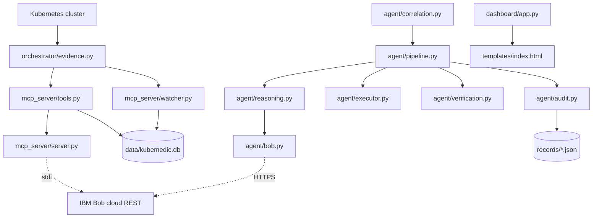
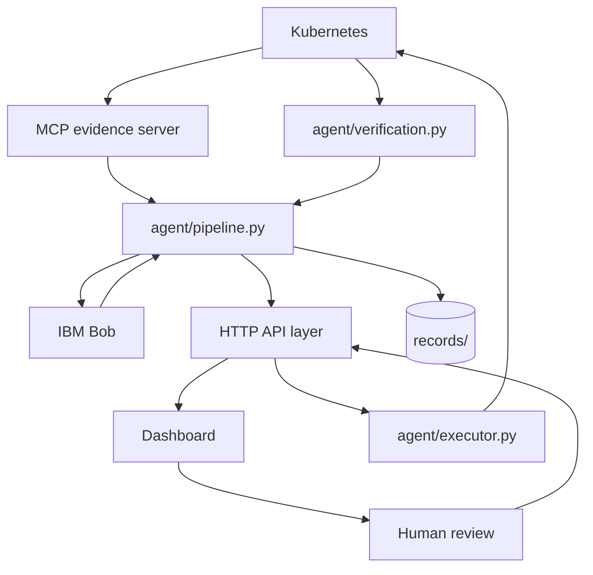

# 02 — Architecture

Only relationships that exist in code are drawn in the first diagram.
Aspirational edges are in the second, marked as such.

## Component diagram — as built

**Read the gaps, not the boxes.**

- There is no edge from `mcp_server` to `agent`. The agent receives its
  `EvidenceSnapshot` from its caller, and the only callers are the tests.
- There is no edge from `dashboard` to `agent`. The dashboard subgraph is
  entirely disconnected from the real system.
- `executor` and `verification` accept injected protocols
  (`KubernetesClient`, `EvidenceReader`) that have **no concrete
  implementation anywhere in the repository** — verified by
  `git grep rollback_deployment`, which finds only the Protocol declaration,
  the dispatch, and test fakes.

## Component diagram — intended

`API`, the `MCP -> AGENT` edge, `EXEC -> K8S` and `K8S -> VERIFY` are **not
implemented**.

---

## Edge inventory — implemented edges only

| Producer | Consumer | Protocol | Data | Reason |
|---|---|---|---|---|
| Kubernetes | `orchestrator/evidence.py` | `kubernetes` client lib | Deployments, pods, events, ReplicaSets, Service proxy | Only layer permitted to read the cluster |
| `evidence.py` | `mcp_server/tools.py` | Python import | `WorkloadState`, `PodState`, `EventItem`, `RevisionInfo`, `HealthResult` | Tools wrap evidence as MCP responses |
| `evidence.py` | `mcp_server/watcher.py` | Python import | Same | Watcher polls to detect anomalies |
| `watcher.py` | SQLite | via `mcp_server/tickets.py` | `Ticket` rows | Anomalies become tickets |
| `tools.py` | SQLite | via `mcp_server/tickets.py` | `Ticket` rows | Ticket CRUD exposed as MCP tools |
| `server.py` | MCP client | stdio JSON-RPC | Tool list and results | How Bob reads evidence |
| `agent/correlation.py` | `agent/pipeline.py` | Python call | `Incident`, excluded tickets | N tickets to 1 incident |
| `agent/reasoning.py` | `agent/bob.py` | Python call | evidence dict, ticket dicts | The single reasoning boundary |
| `agent/bob.py` | `cloud.manufact.com` | HTTPS POST | Prompt, JSON analysis | The only outbound model call |
| `agent/pipeline.py` | `agent/executor.py` | Python call | `Incident` + `KubernetesClient` | Post-approval mutation |
| `agent/pipeline.py` | `agent/verification.py` | Python call | `Incident` + `EvidenceReader` | Independent recovery check |
| `agent/audit.py` | `records/` | filesystem | `IncidentRecord` JSON | Immutable audit artifact |
| `dashboard/app.py` | `templates/index.html` | Jinja2 | none — all data fetched by JS | UI shell |

## Missing edges — each is a task

| Missing edge | Blocked capability | Task |
|---|---|---|
| `mcp_server` to `agent` | Agent cannot obtain real evidence | `MCP-003` |
| `agent` to HTTP API | Nothing can drive the pipeline | `API-001` |
| `dashboard` to API | UI shows fabricated data | `DASH-001` |
| `executor` to Kubernetes | No real remediation possible | `EXEC-001` |
| `verification` to Kubernetes | No real recovery proof | `VER-001` |
| human feedback to `reasoning` | No revised plan after rejection | `REVIEW-002` |

---

## Layer boundary compliance

`AGENTS.md` states the boundary: MCP answers *what is happening*, Bob answers
*what it means*, the executor answers *is this action permitted*, the human
answers *should this happen*, the verifier answers *did it work*.

| Boundary rule | Honoured? | Evidence |
|---|---|---|
| MCP never decides root cause | **YES** | `mcp_server/tools.py` returns evidence only; no mutation tool is registered in `server.py` |
| Bob does the reasoning | **PARTIAL** | True in `agent/`; but correlation is also done deterministically in `agent/correlation.py`, so the layer owns part of Bob's job |
| Executor only allowlisted actions | **YES** | `AllowedAction` enum; `BobAnalysis.from_raw` rejects anything else; `test_action_enum_rejects_kubectl_string` |
| No model-composed shell | **YES** | `_dispatch` maps enum to typed method calls; no shell anywhere |
| Human authorises | **PARTIAL** | Enforced in `agent/`; the dashboard's approve/reject bypasses the agent entirely |
| Verification independent | **PARTIAL** | True in `agent/verification.py`; the dashboard fabricates verification results |
